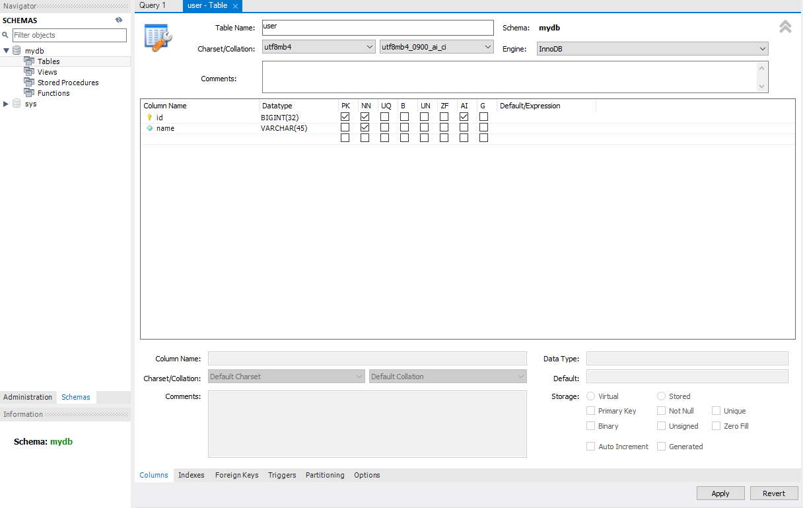

# 6-1. MySQL

### 데이터베이스 설치 및 설정

Docker Desktop 설치 // https://www.docker.com/products/docker-desktop/

> :warning: Docker 실행 시 "Docker desktop is unable to detect a hypervisor" 문구가 뜬다면,
>
> 재부팅 후 BIOS 세팅에 들어가 SVM모드 혹은 Virtual technology를 enable로 바꿔주기 (가상화 모드 사용)
>
> :warning: Docker 실행 시 "Docker Desktop requires a newer WSL kernel version" 문구가 뜬다면,
>
> 콘솔에서 "wsl --update" 를 입력해 시스템 설치하기 (혹은 안내 링크에 따라 패키지 설치하기)

intelliJ에서 install Docker Plugin 클릭해 설치

:arrow_right: 정상적으로 설치되었다면 intelliJ Terminal에 Docker를 입력하면 명령어들이 나옴

<br/>

docker-compose.yaml 파일 생성

```yaml
version: "3"
services:
  db:
    image: mysql:8.0.26
    restart: always
    command:
      - --lower_case_table_names=1
      - --character-set-server=utf8mb4
      - --collation-server=utf8mb4_unicode_ci

    container_name: mysql
    ports:
      - "3306:3306"
    environment:
      - MYSQL_DATABASE=mydb
      - MYSQL_ROOT_PASSWORD=root1234!!
      - TZ=Asia/Seoul
    volumes:
      - D:\fcjava\MYSQL:/var/lib/mysql
```

> :warning: yaml services를 실행하는데 "Only one usage of each socket address" 문구가 뜬다면, 3306 포트를 이미 사용 중일 수 있다. 
>
> 콘솔창에서 "netstat -a -o" 를 입력 후 3306의 PID를 찾아 해당 PID를 ???? 에 넣기. "taskkill /f /pid ????" 

<br/>

MySQL Workbench 설치

MySQL Connections + 클릭, localhost 생성, password는 yaml파일에 기재했듯, root1234!!

:bulb: 실행했다면 docker에서 MySQL이 Running 상태로 표시

기본 table 생성 테스트



<br/>

### MySQL Query

- SQL : 관계형 데이터베이스 관리 시스템의 데이터를 관리하기 위해 설계된 특수 목적의 프로그래밍 언어
  - DDL (Data Definition Language) : 데이터를 정의
    - CREATE : 테이블 생성
    - ALTER : 테이블 구조 변경
    - DROP : 테이블 삭제
    - RENAME : 테이블 이름 변경
    - COMMENT : 테이블 및 컬럼 주석 추가
    - TRUNCATE : 데이터 초기화
  - DML (Data Manipulation Language) : 데이터를 조작
    - SELECT : 데이터 조회
    - INSERT : 데이터 삽입
    - UPDATE : 데이터 업데이트
    - DELETE : 데이터 삭제
  - DCL (Date Control Language) : 데이터 제어
    - GRANT : 특정 데이터 베이스 사용자에게 권한 부여
    - REVOKE : 특정 데이터 베이스 사용자의 권한 회수
    - COMMIT : 트랜잭션의 작업이 정상적으로 완료
    - ROLLBACK : 트랜잭션의 작업이 비정상적으로 종료되어 원래 상태로 복구

<br/>

| 파일 시스템     | DB 모델링              | RDB                            |
| --------------- | ---------------------- | ------------------------------ |
| 파일 (File)     | 엔티티 (Entity)        | 테이블 (Table)                 |
| 레코드 (Record) | 튜플 (Tuple)           | 행 (Row)                       |
| 키 (Key)        | 유니크값 (Identifier)  | 키 (Primary Key), (Unique Key) |
| 필드 (Field)    | 어트리뷰트 (Attribute) | 컬럼 (Column)                  |

<br/>

> Reference
>
> Fastcampus : Signature Backend